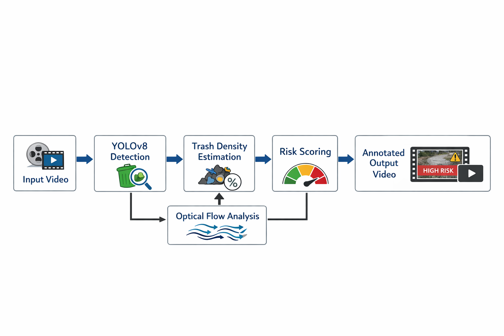
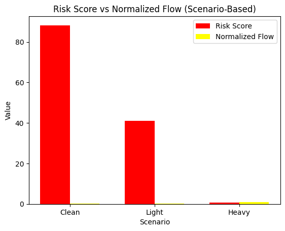

# DrainSight: Video-Based Drainage Risk Assessment Using Deep Computer Vision
**CSC173 Intelligent Systems Final Project**  
*Mindanao State University - Iligan Institute of Technology*  
**Student:** Kaycee T. Nalzaro, 2021-1756  
**Semester:** AY 2025-2026 Sem 1
[](https://python.org) [](https://pytorch.org)

## Abstract
Urban drainage systems are vulnerable to blockage due to improper waste disposal, often leading to flooding and environmental hazards, particularly in densely populated areas. 
This project presents DrainSight, a deep computer vision–based system for assessing drainage risk using video analysis. Instead of relying on supervised training with labeled datasets, 
the system operates in inference mode using a pretrained YOLOv8 model to detect visible objects from video frames. Waste accumulation is approximated through object area coverage, 
while water movement is estimated using optical flow analysis between consecutive frames. These visual cues are combined into a unified risk score that categorizes drainage conditions 
as low, moderate, or high risk. Experimental demonstrations show that the system produces interpretable, real-time outputs with annotated visualizations, including bounding boxes, 
flow statistics, risk levels, and frame rate. The primary contribution of this project is a lightweight, deployable deep computer vision pipeline that integrates object detection and 
motion analysis for practical environmental monitoring without requiring model retraining.

## Table of Contents
- [Introduction](#introduction)
- [Related Work](#related-work)
- [Methodology](#methodology)
- [Experiments & Results](#experiments--results)
- [Discussion](#discussion)
- [Ethical Considerations](#ethical-considerations)
- [Conclusion](#conclusion)
- [Installation](#installation)
- [References](#references)

## Introduction
### Problem Statement
Drainage blockage caused by waste accumulation remains a persistent urban problem that can result in flooding, infrastructure damage, and health risks. In many local contexts, including urban 
areas in Mindanao, drainage inspection is often conducted manually and only after flooding incidents occur. With the increasing availability of surveillance and mobile video recordings, 
there is an opportunity to apply deep computer vision techniques to automatically analyze drainage conditions. This project explores a video-based approach to assessing drainage risk using 
object detection and motion analysis.

### Objectives
- Develop a video-based deep computer vision pipeline for drainage analysis
- Estimate waste accumulation using object detection
- Analyze water movement using optical flow
- Generate an interpretable drainage risk level in real time


## Related Works
- Due to the frequent and sudden occurrence of urban waterlogging, targeted and rapid risk monitoring is extremely important for urban management [1]. Recent study develops a deep learning and computer vision method for flood scene understanding from continuous video. It integrates motion analysis (optical flow-based modules) with object tracking to analyze dynamic scenes like flooding [2].
- The Philippines has contributed to immense discharge of plastic waste into rivers. The development of an object detection model based on YOLOv8 to identify floating debris on a water surface accurately and in real-time, including garbage and invasive plants was proposed recently as an ooptimal solution to this problem [3].
- Several studies adopted the YOLOv8 framework for its modern, anchor-free design, decoupled heads, TensorRT export, and integrated tracking. It also delivers higher detection metrics at comparable inference times, facilitating real-time deployment under the hardware constraints [4].
- Optical flow methods, which track pixel-wise motion between image frames, have also been explored for river flow measurement. Optical flow algorithms can be combined with deep neural networks to capture complex, unstructured motion patterns in natural rivers [5].
- The framework serves as a powerful tool for understanding the dynamics of flood-affected areas and optimizing rescue strategies. This framework capability enhances the efficiency and effectiveness of humanitarian aid operations in flood-impacted regions [6].

## Methodology
### Dataset
This project operates on raw video data rather than a static labeled image dataset.
- Source: Publicly available and manually captured drainage and water-flow videos
- Data Type: Continuous video frames
- Preprocessing: Frame resizing to a fixed width of 640 pixels for real-time inference
Four initial video samples were used to represent different observed conditions:
- Clean drainage (minimal waste, normal flow)
- Light trash accumulation
- Heavy trash accumulation
- Clogged or near-clogged drainage
These categories are used for qualitative evaluation and are not treated as supervised class labels.

## Architecture


The proposed system follows a frame-based video processing pipeline:
- A pretrained YOLOv8n model performs object detection on each frame.
- Detected bounding boxes are used to estimate trash density based on area coverage.
- Optical flow (Farneback method) estimates water movement between frames.
- Trash density and inverse flow magnitude are fused into a drainage risk score.
- Annotated frames are written to an output video with visual overlays

### Key Parameters
| Parameter            | Value                                    |
| -------------------- | ---------------------------------------- |
| YOLO Model           | YOLOv8n (pretrained)                     |
| Input Width          | 640 pixels                               |
| Detection Confidence | 0.05                                     |
| Trash Weight         | 0.8                                      |
| Flow Weight          | 0.2                                      |
| Risk Thresholds      | Low < 0.25, Moderate < 0.50, High ≥ 0.50 |

### Inference Code Snippet
```python
model = YOLO("yolov8n.pt")
results = model(frame, imgsz=640, conf=0.05, verbose=False)
```

## Experiments & Results

### Evaluation Metrics
Since the system operates in inference mode, evaluation is performed at the system level rather than through supervised training metrics.
| Metric                 | Description                                       |
| ---------------------- | ------------------------------------------------- |
| Trash Area (%)         | Percentage of frame covered by detected objects   |
| Optical Flow Magnitude | Mean motion magnitude between frames              |
| Normalized Flow        | Flow magnitude scaled to [0,1]                    |
| Risk Score             | Weighted fusion of trash density and inverse flow |
| Risk Level             | LOW / MODERATE / HIGH                             |
| FPS                    | Frames per second during inference                |

Since the system performs frame-by-frame inference on video data, the computed metrics naturally fluctuate over time due to camera motion, 
object appearance, and water movement. Evaluation is therefore conducted using observed ranges and dominant risk trends rather than single-frame values.

| Scenario         | Expected Risk | Observed Risk | Dominant Trend                    |
| ---------------- | ------------- | ------------- | --------------------------------- |
| Clean drainage   | LOW           | LOW           | Majority LOW, occasional MODERATE |
| Light trash      | MODERATE      | MODERATE      | Consistently MODERATE             |
| Heavy trash      | HIGH          | HIGH          | Consistently HIGH                 |
| Clogged drainage | HIGH          | HIGH          | Consistently HIGH                 |

### Detailed Observed Ranges

| Scenario | Trash Area (%) | Flow Magnitude (Normalized) | Risk Score Range | FPS Range | Dominant Behavior |
|--------|----------------|-----------------------------|------------------|-----------|-------------------|
| Clean drainage | 0.00 – 25.81 | 0.97 (≈ 0.19) | 0.00 – 0.37 | 78.82 – 88.26 | Majority LOW, minor MODERATE |
| Light trash | 13.08 – 35.22 | 1.06 (≈ 0.21) | 0.29 – 0.44 | 34.67 – 41.11 | Consistently MODERATE |
| Heavy / Clogged | 31.67 – 65.37 | 2.31 – 5.24 (0.46 – 1.00) | 0.25 – 0.63 | 54.32 – 68.30 | Consistently HIGH |



The bar graph compares the observed risk score and normalized flow magnitude across clean, light trash, and heavy or clogged drainage scenarios. Clean drainage exhibits low 
risk behavior, characterized by minimal waste accumulation and stable water flow. Light trash conditions show a moderate increase in risk, accompanied by slightly elevated 
flow values, indicating partial obstruction. In contrast, heavy or clogged drainage scenarios demonstrate significantly higher risk scores together with abnormal flow behavior, 
reflected by elevated normalized flow magnitude. This visualization highlights the relationship between waste accumulation, flow irregularities, and increasing drainage risk, emphasizing how unstable or disrupted flow conditions contribute to higher risk classification.

### Demo

## Discussion
- **Strengths:** The system operates in real time, requires no labeled training data, and produces interpretable visual outputs.
- **Limitations:** Trash estimation is based on object detection density and may include non-waste objects when using pretrained weights. Performance may degrade under poor lighting conditions.
- **Insights:** Combining object detection with motion analysis provides more informative risk assessment than using detection alone.

## Ethical Considerations
- **Bias:** The pretrained model may favor object categories present in the COCO dataset.
- **Privacy:** The system does not perform face recognition or identity tracking.
- **Misuse:** The system is intended for environmental monitoring and should not be repurposed for surveillance.

## Conclusion
This project demonstrates a practical deep computer vision system for drainage risk assessment using video analysis. By integrating YOLO-based object detection with optical flow motion estimation, the system generates interpretable risk scores and annotated output videos without requiring supervised training. Future work includes fine-tuning on domain-specific waste datasets, improving object filtering, and deploying the system on edge devices for real-time monitoring.

## Installation
1. Clone the repository:
   ```python
   git clone https://github.com/yourusername/CSC173-DeepCV-YourLastName
   ```         
3. Install dependencies:
   ```python
   pip install -r requirements.txt
   ```
### Requirements.txt
  ```python
  torch>=2.0
  ultralytics
  opencv-python
  numpy
   ```

## Reference
- [1] Huang, H., Lei, X., Liao, W., Li, H., Wang, C., & Wang, H. (2023). A real-time detecting method for continuous urban flood scenarios based on computer vision on block scale. Remote Sensing, 15(6), 1696.
- [2] Yan, X., Zhu, Y., Wang, Z., Xu, B., He, L., & Xia, R. (2025). Intelligent flood scene understanding using computer vision-based multi-object tracking. Water, 17(14), 2111.
- [3] Tomas, J. P. Q., Tupas, J. E. E., Soniel, M. T., Caruz, C. H. M. E., & Babar, D. B. (2024). Real-time detection of floating debris in waterways using YOLOv8. In Proceedings of the 14th International Workshop on Computer Science and Engineering (WCSE 2024).
- [4] Tikász, G., Gyalai-Korpos, M., Fleit, G., & Baranya, S. (2025). Real-time detection of macroplastic pollution in inland waters: development of a lightweight image recognition system. Frontiers in Environmental Science, 13, 1666271.
- [5] Chen, W., Nguyen, K. A., & Lin, B.-S. (2025). Deep learning and optical flow for river velocity estimation: Insights from a field case study. Sustainability.
- [6] Yan, X., Zhu, Y., Wang, Z., Xu, B., He, L., & Xia, R. (2025). Intelligent flood scene understanding using computer vision-based multi-object tracking. Water, 17(14), 2111.

## Github Page
View this project site: [https://github.com/kyrr0o/CSC173-DeepCV-Nalzaro.git]


